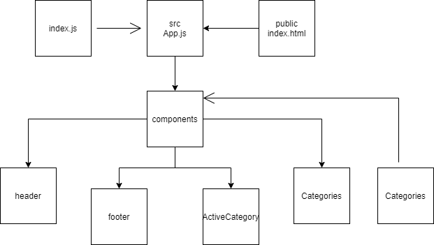

# storefront

## Author: Ibrahem Sarayrah

## LINKS

### LAB - 36

* LAB - 36 pull request : [https://github.com/IbrahemSarayrah/storefront/pull/1](https://github.com/IbrahemSarayrah/storefront/pull/1)

* LAB - 36 [codesandbox.io deployment code](https://codesandbox.io/s/condescending-allen-xstp4)

* LAB - 36 [codesandbox.io deployment link](https://xstp4.csb.app/)

### LAB - 37

* LAB - 37 pull request : [https://github.com/IbrahemSarayrah/storefront/pull/3](https://github.com/IbrahemSarayrah/storefront/pull/3)

* LAB - 37 [codesandbox.io deployment code](https://codesandbox.io/s/friendly-morning-yun0r)

* LAB - 37 [codesandbox.io deployment link](https://yun0r.csb.app/)

### LAB - 38

* LAB - 38 pull request : 

* LAB - 38 [codesandbox.io deployment code]()

* LAB - 38 [codesandbox.io deployment link]()

* LAB - 38 [Backend-github](https://github.com/IbrahemSarayrah/storeAPI)

* LAB - 38 [Backend-heroku](https://lab-38-api.herokuapp.com/items)

### Running the app

>
> npm start
>

#### UML

